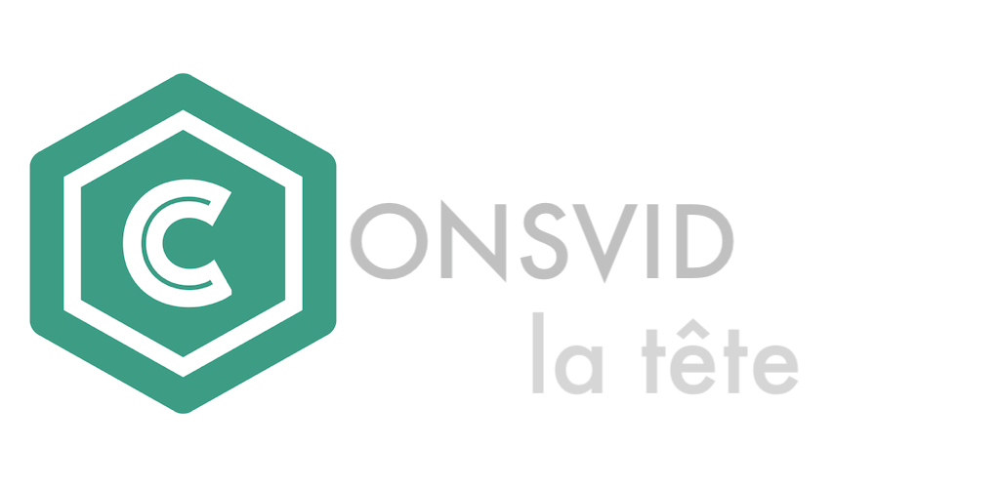
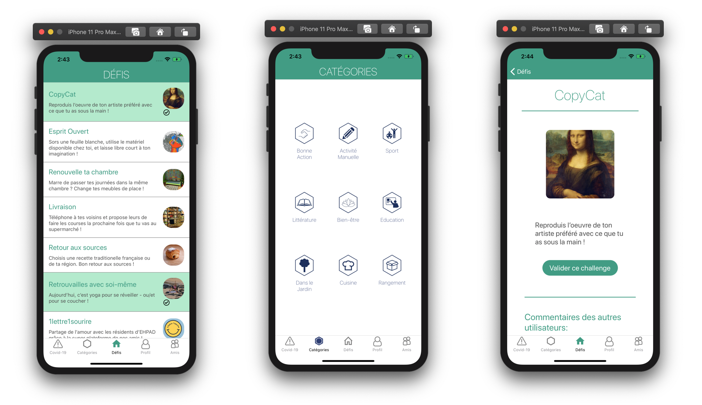
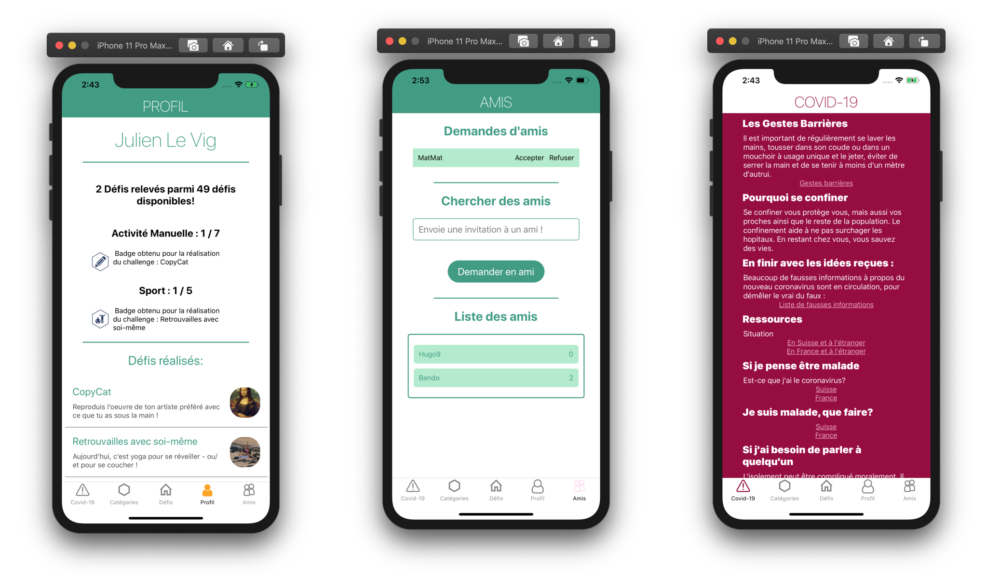

# Consvidlatête-19

## Overview
Due to Covid-19 lockdown, many people are feeling alone and bored at home. We offer a fun app to help and invite users to stay active, maintain social relationships or learning new skills through this social media mobile app. The app offers challenges to realize at home and maintains social interactions via friendship and comment systems.

This project has been realized during the Lauzhack Hackathon 2020 from Friday 3rd April to Monday 6th April by a team of nine EPFL students. It is composed of a frontend developed in Vue Native (the experimental merge of Vue.js and React Native) and a backend implemented in the Java framework Spring. None of us had ever worked with any of the two frameworks before the hackathon.

**Personal contributions:** I contributed mostly to the frontend side of the project, as I had already some experience with web development and I am interested by graphic design and user experience. More specifically, I bootstrapped the Vue Native project, setup the app navigation, implemented the friendship system, the challenge list and the challenge validation page (where one can upload an image and a comment). This project was also the opportunity to apply my software engineering knowledge: as the most experienced git user I helped setting a git routine compatible with a 9-developer team, through issues, pull requests and meetings.

## Contributing

* Install Vue Native and Expo (https://vue-native.io/docs/installation.html)
* Install node.js (https://nodejs.org/en/download)
* Run build.gradle (./back/build.gradle)
* npm install (In the /front repository)
* npm start
* If you are on an iOS phone, scan the QR code
  If you are on an android phone, scan the QR code with the app Expo
* Put your IP address where it was hardcoded in the project (./front/api.js)
  
## User guide
The porting of the application to Android/iOS is in construction. 
For the moment, here is an overview of the app : 
* Login/Register page : the first time you connect you can register with your user name and password. Next time, you can login with this username and password. (For the moment, login with user `Julien Le Vig` and password `1234`)

* Home page : There you can find your nine suggested challenges of the day and you can click on them if you are interested in them. 

* Challenge page : When you click on a challenge, you can find information about the challenge (image, description, and reviews from others). If you finish the challenge you can validate it and enter a comment or add a picture.

* Navigation bar : you can navigate through pages with the bar below. From left to right you can go to 
    * Coronavirus page 
    * List of categories page
    * Home page
    * Personal success page
    * "Who are we?" page 

* Coronavirus page : You can find informations about good practices in those days and links to intersting websites and what to do if you think you are infected.

* List of categories page : On this page you get the list of the different categories of challenges. If you are interested in one of them you can click on it and get all the challenges of this category.

* Personal success page : There you find what you have accomplished so far and the categories you shine in.

* "Who are we?" page : It shares with you a little bit more informations about us. 
